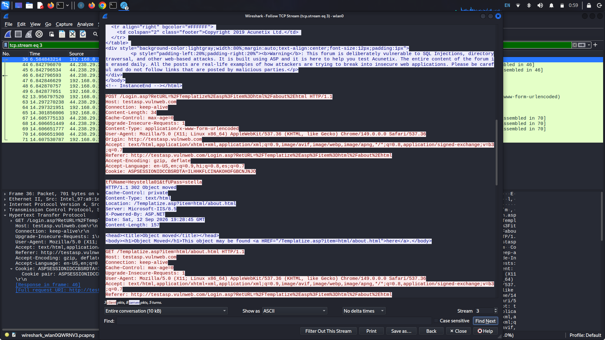

# Session Hijacking & Credential Sniffing Analysis (Insecure HTTP)

This project demonstrates the security risks associated with unencrypted **HTTP** traffic. Using a controlled lab environment against a test application (`://vulnweb.com`), network traffic was analyzed via **Wireshark** to sniff plaintext credentials and successfully perform a **Session Hijacking** attack using stolen session identifiers.

---

## 🔍 Attack Mechanics & Vulnerability

The Hypertext Transfer Protocol (HTTP) transmits data in clear, unencrypted text. This creates two critical vulnerabilities on a local network:

1. **Plaintext Credential Sniffing:** 
   When a user logs into an HTTP site, their username and password travel across the network as readable text. Anyone capturing packets on that network segment can view the credentials without needing to crack encryption.

2. **Session Hijacking (Session Fixation/Session Cloning):** 
   Web applications use session cookies (like `ASPSESSIONID`) to keep track of authenticated users so they don't have to log in on every single page click. If an attacker sniffs this session token, they can copy it into their own browser's developer tools. The web server cannot distinguish between the real user and the attacker, granting the attacker instant access to the authenticated account without ever knowing the password.

---

## 📊 Proof of Concept & Packet Analysis

### 1. Sniffing Credentials in Transit
The Wireshark TCP stream reconstruction captures the exact payload transmitted during the authentication phase:

* **Protocol Used:** HTTP POST request directed to `/login.asp`.
* **Exposed Data Payload:** The application transmitted the form data unencrypted. In the raw stream, the user credentials are exposed clearly in the body payload:
  * **`tfUName`:** `heystella01`
  * **`tfUPass`:** `stella`
* **Session Token Allocation:** The server responded by assigning a session identifier via the cookie header:
  * **Cookie:** `ASPSESSIONIDCCBSRDTA=ILHHKFLCINAKOHOFGBCNJNJO`

### 2. Executing the Session Hijack
Using a browser extension (Cookie-Editor), the captured session token was manually injected into an unauthenticated browser instance:

* **Target Domain:** `://vulnweb.com`
* **Cookie Alteration:** By replacing the local session value with the intercepted string `ILHHKFLCINAKOHOFGBCNJNJO`, the application recognized the browser session as valid.
* **Result:** Full access to the authenticated user's dashboard (`acuforum`) was achieved immediately without performing a traditional login sequence.

---

## 🛡️ Mitigation Strategies

Securing web applications against credential sniffing and session theft requires strict adherence to Transport Layer Security (TLS) standards:

* **Enforce HTTPS (TLS/SSL):** 
  Migrate all web services from HTTP to HTTPS. TLS encrypts the entire payload—including login forms, URLs, parameters, and headers—rendering captured network packets unreadable to sniffers.
  
* **Secure Cookie Flags:** 
  Configure application session cookies with defensive attributes to limit their exposure:
  * **`Secure` Flag:** Ensures cookies are only ever transmitted over encrypted HTTPS connections, preventing accidental leakage over HTTP.
  * **`HttpOnly` Flag:** Restricts client-side scripts (like JavaScript) from accessing the cookie, heavily mitigating risks from Cross-Site Scripting (XSS) session theft.
  * **`SameSite=Strict/Lax`:** Restricts cookies from being sent along with cross-site requests, protecting against Cross-Site Request Forgery (CSRF).

---
*Disclaimer: This documentation is created strictly for educational purposes and authorized web application security evaluations inside an isolated testing environment.*
